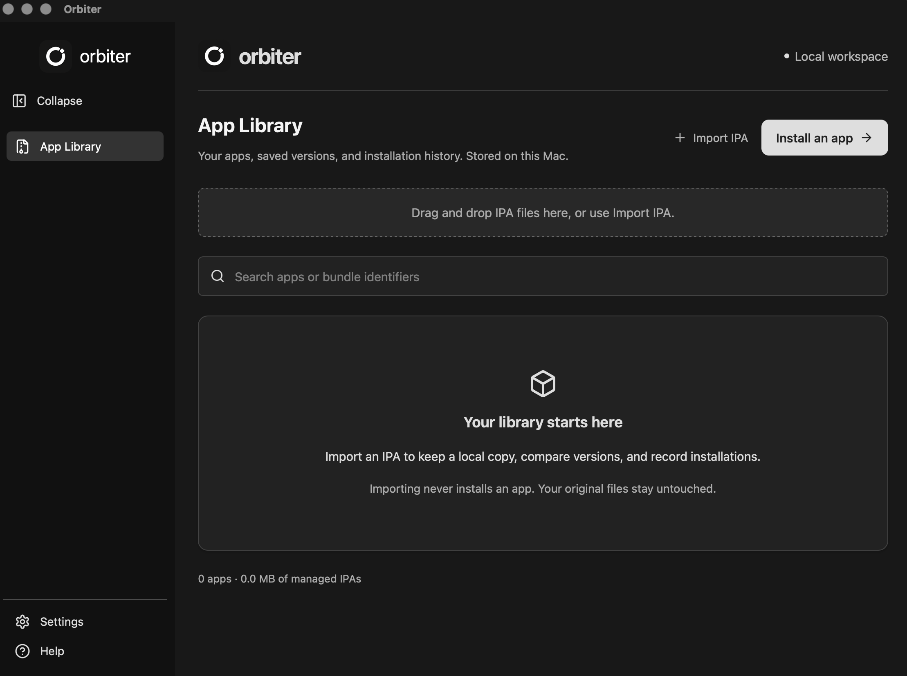

<p align="center">
  
</p>

# Orbiter

An open-source desktop app for managing IPAs and installing apps on your iPhone. Built with Rust, Tauri, and React.



- Import IPAs with drag and drop and keep multiple versions in your app library.
- Install an already-signed IPA or re-sign a copy with your Apple account.
- Review installation history and known profile expiration dates.
- Keep your library locally, with light and dark themes.

Requires an Apple Silicon Mac on macOS 11 or later. See [Platform support](#platform-support) for what does and does not work elsewhere.

## Install

Download the latest DMG from [Releases](https://github.com/sger/orbiter/releases), open it, and drag Orbiter to Applications.

Orbiter is not signed with an Apple Developer ID, so macOS blocks the first launch and says it cannot check the app for malicious software. To allow it:

1. Open Orbiter and dismiss the warning.
2. Go to **System Settings → Privacy & Security**, scroll to **Security**, and click **Open Anyway** beside the message about Orbiter.
3. Open Orbiter again and confirm.

Only the first launch needs this. Each release ships a `.sha256` file if you want to check the download.

## Build from source

Install [Rust](https://www.rust-lang.org/tools/install), Node.js 22.12 or later, and the [Tauri macOS prerequisites](https://v2.tauri.app/start/prerequisites/#macos).

```sh
git clone https://github.com/sger/orbiter.git
cd orbiter
npm ci
npm run tauri build -- --bundles app
```

Copy `target/release/bundle/macos/Orbiter.app` into Applications and open it. A build made on your own Mac opens without the step above.

## Platform support

macOS on Apple Silicon is the supported platform. Releases are built there, and it is the only platform where the whole flow works.

Orbiter also compiles and runs on Windows. The app library — importing IPAs, keeping versions, searching, reading what is stored locally — has no macOS-only parts, but has not been exercised there. Everything that needs Apple does not work, and reports that rather than failing quietly:

- Signing in with an Apple account is macOS-only. Local authentication uses the macOS system frameworks, and there is no remote fallback.
- Re-signing therefore cannot run at all, because it needs a certificate obtained through that sign-in.
- Signing keys cannot be stored, because storage is the macOS login Keychain.
- Apple-optimised app icons do not render, because the converter is a macOS system tool.

Installing an already-signed IPA over USB is untested on Windows, and would also need Apple Mobile Device Support present for the device connection.

To build on Windows, install the [Tauri Windows prerequisites](https://v2.tauri.app/start/prerequisites/#windows) in place of the macOS ones; `npm run tauri dev` then builds and launches. The `--bundles app` option above is macOS-only.

## Install an app on your iPhone

1. Connect your iPhone by USB, unlock it, and establish trust in Finder.
2. Open **App Library** and choose **Install an app**. Import an IPA or select a saved version.
3. Select your iPhone and run the checks. Sign in with your Apple account only if re-signing is needed or you choose it.
4. Review the requested changes and installation details, then confirm installation.

Original IPAs stay unchanged. Passwords are never saved. Re-signing can affect app capabilities, and Apple account limits still apply. Expiration dates do not confirm that an app is currently installed or working.

You can also inject one or more `.dylib` files into the app at re-sign — they load at launch via `@executable_path/Frameworks` and run with the app's entitlements. Injection is opt-in and the plan states it as a consequence before you confirm; the original IPA is still never written to. See [docs/architecture.md](docs/architecture.md#dylib-injection).

## Development

```sh
npm ci
npm run tauri dev
```

For a browser-only UI preview, use `npm run dev`; device and signing operations require the desktop app.

```sh
npm run build
npm test # Requires Google Chrome
cargo test --locked -p orbiter-core
cargo clippy --locked --workspace --all-targets -- -D warnings
```

Issues and pull requests are welcome.

## License

MIT — see [LICENSE](LICENSE).

Orbiter vendors a patched copy of [isideload](vendor/isideload) (MIT) and follows the selector reference in [SideStore/MacAnisette](https://github.com/SideStore/MacAnisette) (MIT), whose license is kept in [licenses/MacAnisette-MIT.txt](licenses/MacAnisette-MIT.txt). Apple's frameworks are loaded from the system, never redistributed.

## Documentation

[Installation flow](docs/guided-installation.md) · [App library](docs/app-library.md) · [Architecture](docs/architecture.md) · [Data handling](docs/local-authentication.md) · [Validation status](docs/validation.md) · [Releasing](docs/release.md)
